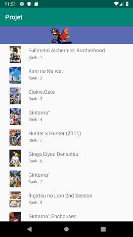
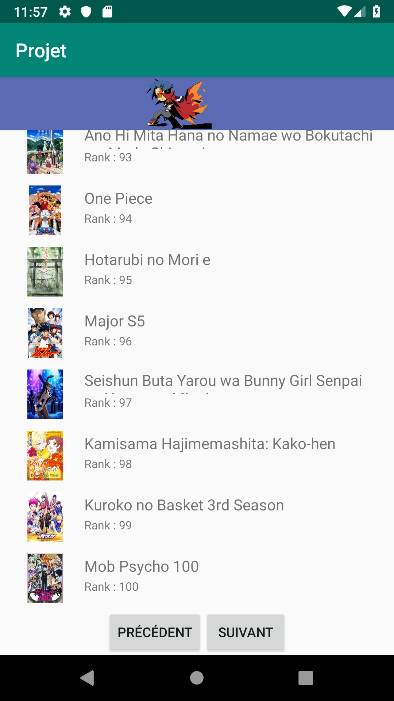
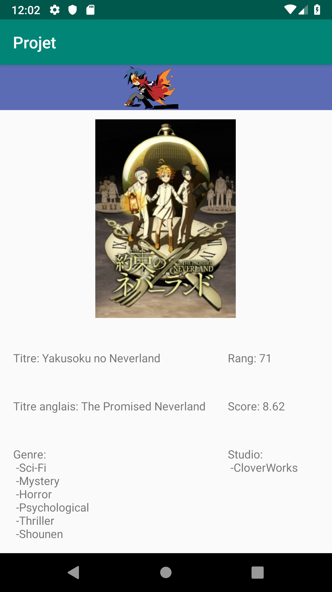

# Application Top Anime.

## Auteur
 TARBY Arnaud
 
## Présentation

Application affichant la liste du top des animés du site myanimelist.net ainsi que leurs détails.

## Consigne respectées : 

- 2 Activités
- Appel REST
- Affichage d'une liste via RecyclerView
- Affichage du détail d'un item.
- Supplémentaire:
	- Architecture MVC

### Ecran principale:

- Affiche le top 50 des animés avec des bouttons en bas de liste pour les 50 animés suivants/précédants

   

### Ecran d'informations:

- Affiche diverses informations sur l'animé sélectionné tel que:
	- Titres japonais / anglais
	- Score et rang
	- Genres
	- Studios
	- Synopsis

