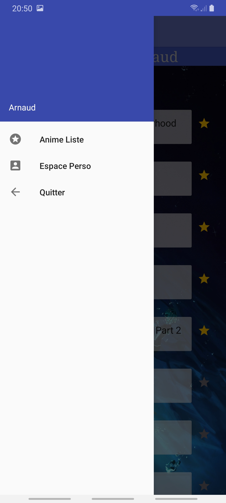

# Application Mobile 4A : My animeList

## Auteur
 TARBY Arnaud
 
## Présentation

Application permettant de choisir les animés à partir d'une liste récupérer par appel api avec accès à différentes pages. L'utilisateur à aussi accés à une page lui montrant sur un graphe circulaire les statistique concernant les genres des animés ayant était ajouté à la liste. Enfin l'utilisateur ne perd pas ses données lorsqu'il quitte l'application.

## Contenu globale: 

- 2 Activités
- 3 Fragments
- Material design
- Architecture MVC
- Appels API
- RecyclerView
- Ajout d'objets à une liste sauvegardé en Internal Storage.
- Mise en cache des appels api.
- Graphe de statistiques des genres vue ( librairie : MPAndroidChart )
	

### Ecran de connexion : 

- L'utilisation requier que l'utilisateur choisisse un nom pour pouvoir sauvegarder ses données.

   

### Ecran Principale : Fragment - Liste d'animé :

- Affiche les informations de base d'un animé et des boutons "favoris" pour les ajoutés à la liste de l'utilisateur.

  

- Drawer pour changer de fragment : 

### Ecran Principale : Fragment - Profile :

- Affiche des nombres d'épisode regardés ainsi que les statistiques des genres regardés dans un graphe circulaire et possibilité de cliquer sur les éléments du graphe.

 

### Ecran Principale : Fragment - Quiter :

- Permet à l'utilisateur de quitter la vue principale et sauvegarder sa liste ou alors de retourné à la page de liste d'animé.

- On peut retrouver que si on s'identifie avec un nom déjà entré la liste de favoris sera récupérer à partir des fichier de sauvegarde: 

